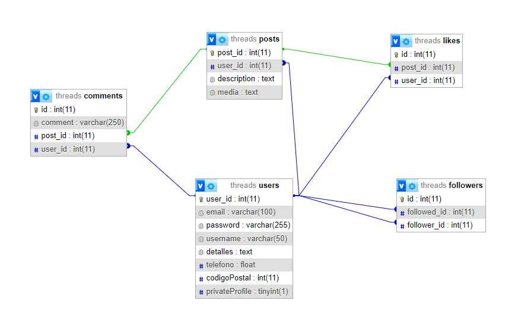

# Sistema de funcionalidades de Threads app

Threads es el lugar donde las comunidades se reúnen para hablar de todo, desde los temas que te interesan hoy hasta lo que será tendencia mañana. Sea lo que sea lo que te interese, puedes seguir y conectar directamente con tus creadores favoritos y con otras personas a las que les gusten las mismas cosas, o crear tus propios seguidores fieles para compartir tus ideas, opiniones y creatividad con el mundo.

### Objetivo General

Crear un sistema de las funcionalidades de Threads que facilite la interacción entre usuarios, permitiendo a los usuarios  opinar sobre diversos temas de interés y conectarse con sus creadores favoritos y personas afines. Además, se busca proporcionar un sistema completo que permita la autenticación y registro de usuarios, la gestión de perfiles, la posibilidad de publicar imágenes y textos, la visualización de seguidores y seguidos, así como la capacidad de comentar en las publicaciones de otros usuarios. 

### Objetivos Especificos

    1. Crear un sistema de autenticación y registro de usuarios que permita crear y administrar perfiles de usuario.
    
    2. Implementar funcionalidades para que los usuarios puedan subir imágenes y textos como publicaciones en su perfil.
    
    3. Agregar la posibilidad de dar like en las publicaciones de otros usuarios.
    
    4. Diseñar una funcionalidad para que los usuarios puedan comentar en las publicaciones de otros usuarios.

### Diseño de Base de Datos

### Pasos

    1. Descargue o clone el repositorio
    2. Ejecutar el siguiente comando para instalar las dependencias necesarias para que funcione => npm i
    3. configurar archivo .env en la raiz del proyecto y  como esta en el .envexample
    4. ejecutar el proyecto => npm run dev
    5. Probar EndPoints

### EndPoints

    1. Registro de Usuarios => POST http://localhost:5001/user/auth

        Datos de entrada: 
        {
            "correo":"iivaan437@gmail.com",
            "contrasenia":"password",
            "usuario":"IvS_24",
            "info":"futuro programador full stack",
            "celular":322194656,
            "codigo_postal":68001
        }

    2. Login de Usuarios => POST http://localhost:5001/user/login

        Datos de entrada: 
        {
            "email":"iivaan437@gmail.com",
            "password":"ivan"      
        }

    3. Subir Posts => POST http://localhost:5001/post/addPost

        Pasos: Seleccionar en thunder en el Body en formato "Form" y para permitir subir archivos
        darle click en files en la parte superior derecha, en este caso la imagen del posts es requerida,

        Campos de entrada:
        
        description: "Mi primer posts"
        media: elegir un archivo tipo imagen 

    4. Ver Posts del usuario logeado => GET http://localhost:5001/post/getPostUser

    5. Ver posts de un usuario especifico mediante el username => GET http://localhost:5001/post/getPostUser/:username

    6. Añadir comentarios a un posts => POST http://localhost:5001/comment/addComment/:post_id

        Datos de entrada: 
        {
            "comment":"Mi primer comentario"
        }

    7. Traer los comentarios de un posts en especifico => GET http://localhost:5001/comment/getComment/:post_id

    8. Hacer like en algun posts => POST http://localhost:5001/like/addLike/12

    9. Traer los likes de un post en especifico => GET http://localhost:5001/like/getLike/12